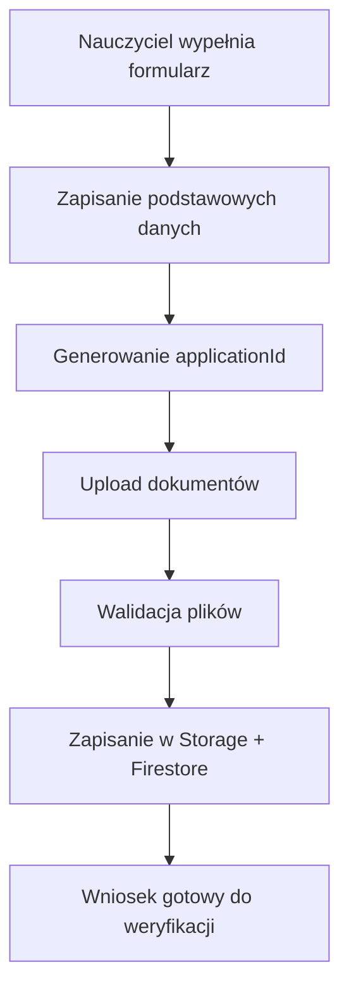
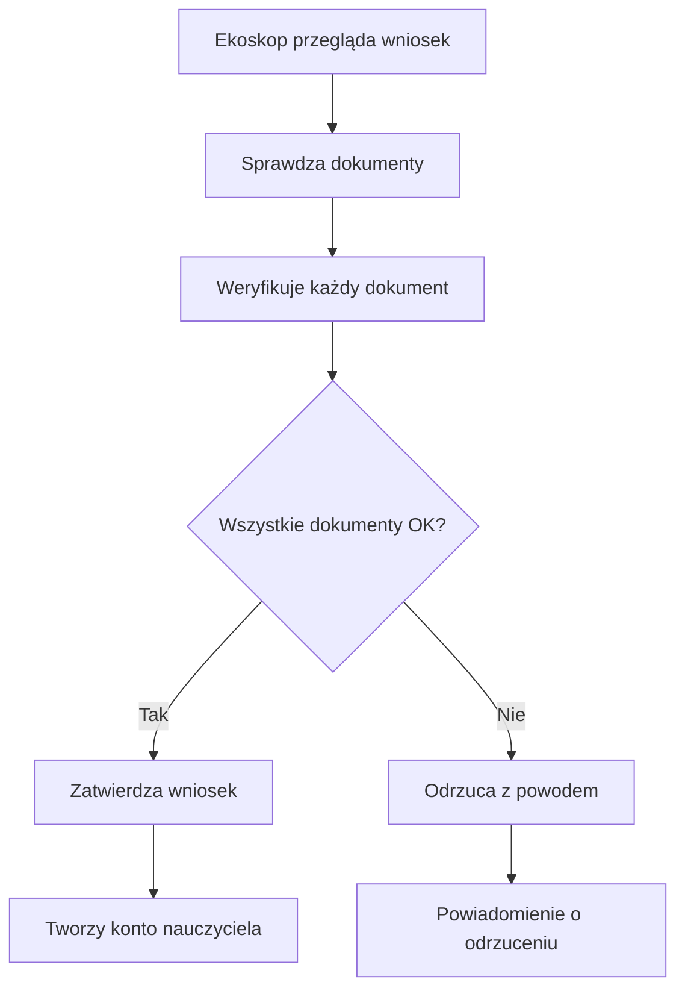

# 🔒 Implementacja Systemu Przesyłania Dokumentów dla Wniosków Nauczycieli

## 📋 Przegląd Implementacji

System umożliwia bezpieczne przesyłanie i weryfikację skanów dokumentów (legitymacja służbowa i zaświadczenie o zatrudnieniu) w ramach procesu rejestracji nauczycieli.

## 🗄️ Zaktualizowana Struktura Bazy Danych

### Firebase Firestore - Kolekcja `teacherApplications`

```javascript
teacherApplications/{applicationId}/
  - email: "jan.nowak@email.com"
  - displayName: "Jan Nowak"
  - schoolId: "szkola_podstawowa_1_uid"
  - schoolName: "Szkoła Podstawowa nr 1 w Warszawie" // Denormalizacja
  - proposedClassName: "Klasa 5b"
  - phone: "+48 123 456 789" // Opcjonalne
  - additionalInfo: "Jestem nauczycielem od 5 lat..." // Opcjonalne
  - status: "pending" | "approved" | "rejected" // Domyślnie 'pending'
  - createdAt: Timestamp
  - reviewedAt: Timestamp // Kiedy ekoskop dokonał oceny
  - reviewedBy: "ekoskop_user_uid" // Który ekoskop dokonał oceny
  - rejectionReason: "Niepełne dokumenty" // Tylko przy statusie 'rejected'
  - approvedTeacherId: "utworzony_nauczyciel_uid" // Tylko przy statusie 'approved'

  // 🔒 BEZPIECZEŃSTWO: Dokumenty przechowywane w FireStorage
  - documents: {
    - idCard: {
      - fileName: "legitymacja_jan_nowak.jpg"
      - storagePath: "teacher-applications/{applicationId}/id-card.jpg"
      - uploadedAt: Timestamp
      - fileSize: 1024567 // bytes
      - mimeType: "image/jpeg"
      - verified: false // Czy ekoskop zweryfikował dokument
    }
    - employmentCertificate: {
      - fileName: "zaswiadczenie_zatrudnienie.pdf"
      - storagePath: "teacher-applications/{applicationId}/employment-cert.pdf"
      - uploadedAt: Timestamp
      - fileSize: 2048123 // bytes
      - mimeType: "application/pdf"
      - verified: false
    }
  }

  // 🔒 AUDIT LOG dla bezpieczeństwa i śledzenia
  - auditLog: [
    {
      - action: "created" | "reviewed" | "approved" | "rejected" | "document_uploaded" | "document_verified"
      - timestamp: Timestamp
      - performedBy: "user_uid" // Kto wykonał akcję
      - details: "Uploaded ID card document" // Dodatkowe szczegóły
      - documentType: "idCard" | "employmentCertificate" // Dla akcji na dokumentach
    }
  ]

  // Metadata dla audytu
  - metadata: {
    - submissionSource: "web" | "mobile"
    - userAgent: "Mozilla/5.0..." // Informacje o przeglądarce
  }
```

### Firebase Storage - Struktura folderów

```
teacher-applications/
  {applicationId}/
    id-card.{extension}        // Skan legitymacji (jpg, png, pdf)
    employment-cert.{extension} // Zaświadczenie o zatrudnieniu (pdf, jpg, png)
```

## 🛡️ Bezpieczeństwo

### Firebase Storage Rules

```javascript
rules_version = '2';
service firebase.storage {
  match /b/{bucket}/o {
    // 🔒 WNIOSKI NAUCZYCIELI - tylko właściciel może uploadować, ekoskop może czytać
    match /teacher-applications/{applicationId}/{document} {
      // Pozwól na upload tylko jeśli użytkownik to właściciel wniosku
      allow write: if request.auth != null
        && isOwnerOfApplication(applicationId)
        && isValidTeacherDocument(document)
        && request.resource.size < 10 * 1024 * 1024; // Max 10MB

      // Pozwól na odczyt tylko ekoskopowi lub właścicielowi
      allow read: if request.auth != null
        && (isEkoskop() || isOwnerOfApplication(applicationId));
    }

    function isEkoskop() {
      return get(/databases/$(database)/documents/users/$(request.auth.uid)).data.role == "ekoskop";
    }

    function isOwnerOfApplication(applicationId) {
      return get(/databases/$(database)/documents/teacherApplications/$(applicationId)).data.createdBy == request.auth.uid;
    }

    function isValidTeacherDocument(document) {
      return document in ['id-card.jpg', 'id-card.png', 'id-card.pdf',
                         'employment-cert.jpg', 'employment-cert.png', 'employment-cert.pdf'];
    }
  }
}
```

### Firestore Rules dla wniosków

```javascript
match /teacherApplications/{applicationId} {
  // Każdy może utworzyć wniosek (do rejestracji)
  allow create: if request.auth != null
    && isValidTeacherApplication()
    && resource == null;

  // Tylko właściciel może czytać swój wniosek lub ekoskop wszystkie
  allow read: if request.auth != null
    && (resource.data.createdBy == request.auth.uid || isEkoskop());

  // Tylko ekoskop może aktualizować status wniosku
  allow update: if request.auth != null
    && isEkoskop()
    && isValidStatusUpdate();

  // Nikt nie może usuwać wniosków (dla audytu)
  allow delete: if false;
}
```

## 📁 Pliki Implementacji

### 1. `DocumentUploadService.js` - Serwis obsługi uploadów

**Funkcjonalności:**

- Walidacja plików (typ, rozmiar)
- Upload do Firebase Storage
- Aktualizacja metadanych w Firestore
- Audit log dla wszystkich operacji
- Weryfikacja dokumentów przez ekoskop
- Bezpieczne usuwanie dokumentów

**Kluczowe metody:**

- `uploadTeacherDocument()` - Upload dokumentu
- `getDocumentDownloadURL()` - Pobieranie URL do podglądu
- `verifyDocument()` - Weryfikacja dokumentu przez ekoskop
- `deleteDocument()` - Usuwanie dokumentu

### 2. `DocumentUpload.jsx` - Komponent UI

**Funkcjonalności:**

- Drag & drop interface
- Walidacja po stronie klienta
- Podgląd przesłanych dokumentów
- Informacje o statusie weryfikacji
- Responsywny design

### 3. Zaktualizowane komponenty

**`TeacherApplicationPage.jsx`:**

- Dwuetapowy proces: najpierw dane podstawowe, potem dokumenty
- Integracja z DocumentUpload
- Walidacja kompletności wniosku

**`TeacherApplicationsPage.jsx`:**

- Wyświetlanie statusu dokumentów
- Przyciski weryfikacji dla ekoskop
- Podgląd dokumentów
- Walidacja przed zatwierdzeniem

## 🔄 Przepływ Procesu

### 1. Składanie Wniosku przez Nauczyciela



### 2. Weryfikacja przez Ekoskop



## ⚠️ Ważne Uwagi Bezpieczeństwa

### 1. Walidacja po stronie serwera

- Firebase Rules sprawdzają uprawnienia
- Rozmiar plików ograniczony do 10MB
- Tylko dozwolone typy plików (JPG, PNG, PDF)

### 2. Audit Trail

- Wszystkie akcje są logowane
- Śledzenie kto i kiedy wykonał operację
- Metadata przeglądarki i źródła zgłoszenia

### 3. Zasada najmniejszych uprawnień

- Wnioskodawcy mogą tylko uploadować swoje dokumenty
- Ekoskop może przeglądać i weryfikować wszystkie dokumenty
- Dokumenty są widoczne tylko dla właściciela i ekoskop

### 4. Ochrona przed nadużyciami

- Limity rozmiaru plików
- Walidacja typów MIME
- Audit log dla wszystkich operacji

## 🧪 Testowanie

### 1. Test uploadu dokumentów

```bash
# Sprawdź czy upload działa dla różnych typów plików
- JPG (mały i duży)
- PNG (mały i duży)
- PDF (mały i duży)
- Nieprawidłowy typ (powinien zostać odrzucony)
```

### 2. Test uprawnień

```bash
# Sprawdź czy tylko właściciel może uploadować
# Sprawdź czy tylko ekoskop może weryfikować
# Sprawdź czy dokumenty są widoczne tylko dla uprawnionych
```

### 3. Test procesu zatwierdzania

```bash
# Sprawdź czy wniosek bez zweryfikowanych dokumentów zostanie odrzucony
# Sprawdź czy po weryfikacji wszystkich dokumentów można zatwierdzić wniosek
```

## 🚀 Deployment

### 1. Konfiguracja Firebase Storage

- Skonfiguruj bucket w Firebase Console
- Wdróż rules bezpieczeństwa
- Ustaw CORS jeśli potrzebne

### 2. Konfiguracja Firestore

- Wdróż rules bezpieczeństwa dla kolekcji `teacherApplications`
- Sprawdź indeksy dla wydajności zapytań

### 3. Monitorowanie

- Skonfiguruj alerty dla dużych plików
- Monitoruj koszty Storage
- Śledź metryki security rules

## 📊 Metryki do Monitorowania

- Liczba przesłanych dokumentów dziennie
- Średni rozmiar plików
- Czas weryfikacji wniosków przez ekoskop
- Błędy uploadu i ich przyczyny
- Naruszenia security rules
